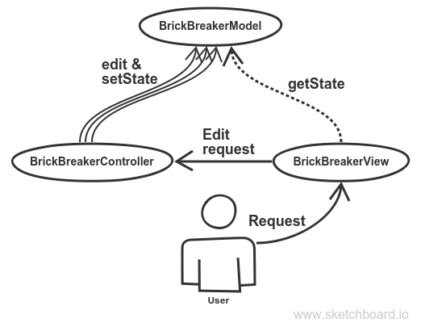

# Fundamentals of object-oriented programming

## Repository description
Contains complete labs from the [source](https://sites.google.com/site/nguoop/prakticeskie-zadania-java).

## Projects descriptions

### Text analyzer (lab_1_text_analyzer)
// ...

### Logoworld (lab_2_logoworld)
// ...

### Stack Calculator (lab_2_stack_calculator)
// ...

### Brick Breaker Game (lab_3_brick_breaker_game)
Popular game with graphical interface made using a pattern MVC. Project sketch:

## Links
* [Course lectures](https://sites.google.com/site/nguoop/materialy-lekcij-java)